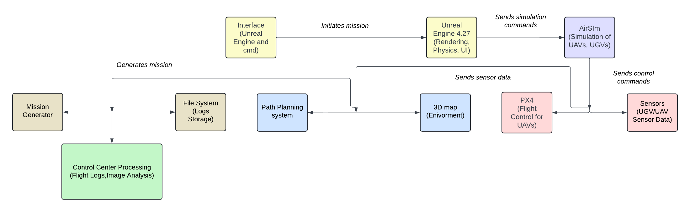

# VRProject_DocDrone

# Introduction 🚀

This project involves creating a virtual control room using Unreal Engine 4.27 and the AirSim plugin, which provides a detailed simulation environment for smart ambulances (UGVs) and drones (UAVs) in medical payload transport. The simulation features various types of terrain, urban landscapes, and obstacles that these vehicles must navigate. It allows for the testing and validation of different sensors, including LIDAR, RGB, and thermal cameras.

The simulation supports the development and validation of algorithms for path planning, navigation, and real-time data collection. It enables the integration of new features and applications into the vehicle's hardware and software. Furthermore, the use of AI and machine learning algorithms in the simulation enhances the precision and efficiency of navigation and data analysis, contributing to the overall advancement of medical transport solutions.

## Objectives

1. **Integrate navigation sensors** such as GPS and barometers.
2. **Create a mission generator and logging system** for data recording and analysis.
3. **Ensure platform compatibility** with Windows and Linux.
4. **Analyze mission performance and UAV health** in a control center.
5. **Ensure carrying medicines from the medical center** to the patient in a square path passing by charging stations.

## Tools and Components

### AirSim/PX4 Specifications

- **Safety:** Failsafe, geofencing, return to home (RTH).
- **Control:** Attitude, Position, Velocity.
- **Flight Modes:** Manual, Stabilized, Altitude, Position, Offboard, Mission.
- **Hardware:** Supports various flight controllers, GPS modules, IMUs, barometers.

### Unreal Engine Environment

- **Graphics:** High-fidelity, real-time rendering.
- **Landscapes:** Customizable terrains.
- **Version:** Unreal Engine 4.27.
- **Integration:** Uses Cesium for 3D environments, Google Maps for real-world data, and Landscape Mountain for terrain.

## Getting Started

### DroneShell API Control

1. Start the Unreal Engine project and press Play.
2. Run DroneShell.exe in the AirSim folder.
3. Use commands like RequestControl, Arm, TakeOff, Land.
4. Type `help` for additional commands.

### PX4 SITL API Control

- Runs on Linux, communicates with PX4 using MAVLink API.
- Uses UDP (Ports 14550 or 18570) and TCP (Port 4560).
- Requires LocalHostIP and ControlIP configuration.

### Python API Control

- Controls position, altitude, weather, and more using Python.
- Example trajectory: Hospital > Charging Station 1 > Patient > Charging Station 2 > Hospital.
- Coordinates: (125, 0), (125, -130), (0, -130), (0, 0).

## Enhancements and Future Work
- Upgrade to Unreal Engine 5.3/5.4 for advanced simulation.
- Incorporate machine learning for autonomous navigation and efficiency.
- Implement real-time analytics for mission performance using drone RGBD cameras.

## Students:

- Ines Haouala
- Benkredda Roumaissa
- Karim Triki
